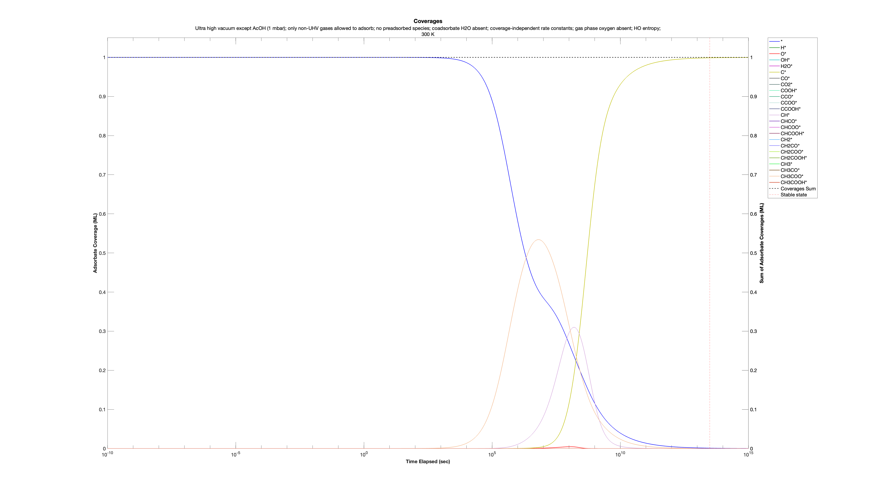
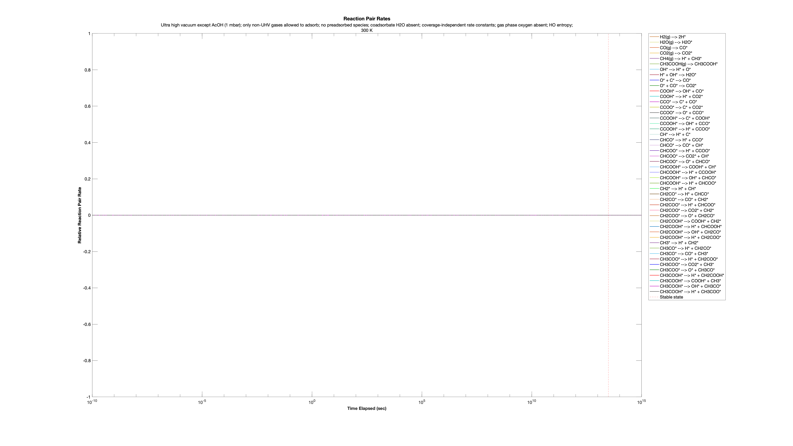

# Microkinetic Modeling in Julia — Original Research Implementation

**PhD dissertation research | Heterogeneous catalysis | Scientific computing**

This repository contains the original Julia microkinetic-modeling implementation developed for my PhD research in Chemical Engineering at Oregon State University. It combines reaction-network kinetics with thermodynamic calculations, DFT-derived energetic inputs, differential-equation integration, and sensitivity analysis for heterogeneous catalytic systems.

The original research implementation is preserved here. A substantially redesigned successor is planned as a separate project.

## Capabilities

- **Reaction-network modeling:** Gas-phase and adsorbed species, surface sites, configurations, elementary reaction steps, and rate constants.
- **Thermodynamics:** Electronic, vibrational, rotational, and translational contributions, with configurable partition-function treatments.
- **Coverage-dependent energetics:** Support for interpolation of configuration energetics using radial basis functions, including polyharmonic-spline options.
- **Numerical integration:** Configurable ODE solver, tolerances, time scaling, and numerical formats (`Float64`, `Double64`, and `BigFloat`).
- **Sensitivity analysis:** Automatic differentiation with `ForwardDiff.jl`, including degree-of-rate-control (DRC) and degree-of-selectivity-control (DSC) calculations.
- **Analysis outputs:** Species fractions and rates, reaction rates, energies, turnover-related quantities, and sensitivity results.

Not every capability is exercised by the example below.

## Included example: Acetic acid decomposition on Pd(111)

The [`AcOH_Decomp/`](Examples/AcOH_Decomp_01/300 K) directory contains an XML configuration, simulation outputs, a run log, and plots for an acetic acid decomposition model on Pd(111) at 300 K.

**Important:** This example uses **coverage-independent rate constants/energetics**. It does **not** demonstrate the framework's coverage-dependent interpolation functionality.

### Recorded run settings and results

| Item | Recorded value |
| --- | --- |
| Run | `AcOH_Decomp_01` |
| Surface | Pd(111) |
| Temperature | 300 K |
| Acetic acid pressure | 1 mbar (as described in the run nickname) |
| Simulated time span | 1 × 10¹⁵ s |
| Numerical format in source's example invocation | `Double64` |
| Solver iterations | 48,496 |
| Stable state detected | Yes |
| Steady state detected | No |
| Sensitivity analysis | Enabled |

A **stable state** was detected, but a **steady state** was not. These are distinct outcomes in the recorded analysis.  Herein, a stable state is when coverages are not changing (within a specified tolerance) and a steady state is when the atomic rates of the gas phase reactants and products are balanced (within a specified tolerance).  This AcOH on Pd(111) system illustrates how these two states are not equivalent - the adsorbate coverages change very slowly after acetate coverage peaks, but the system is not at steady state until carbon coverage approaches unity.

### Selected plots

**Species fractions**

**Reaction-pair rates**

**Degree of rate control for acetic acid**

.png)

**Degree of selectivity control: CO₂ relative to CO**

_CO(g).png)

Additional plots and numerical outputs are available under [`Examples/AcOH_Decomp_01/300 K/Plots/pictures/`](Examples/AcOH_Decomp_01/300 K/Plots/pictures/) and [`AcOH_Decomp_01/`](Examples/AcOH_Decomp_01/300 K/).

### Inputs and outputs

- [`AcOH_Decomp_01.xml`](Examples/AcOH_Decomp_01/300 K/AcOH_Decomp_01.xml): Model configuration and run options.
- [`RunData__OUTPUT__General.txt`](Examples/AcOH_Decomp_01/300 K/RunData__OUTPUT__General.txt): Recorded run settings and summary.
- [`RunLog.txt`](Examples/AcOH_Decomp_01/300 K/RunLog.txt): Execution log.
- Other `RunData__OUTPUT__*.txt` files: Species, reaction, energy, DRC, and DSC results.

## Running the code

The main source file includes a documented entry point named `Microkinetics__Core__Main` and an example invocation near its end. The XML input and source file are included in the sample directory.

The original code requires a Julia environment with the packages imported by the source, including `XMLDict`, `XLSX`, `OrderedCollections`, `StaticArrays`, `Bessels`, `Combinatorics`, `ForwardDiff`, `OrdinaryDiffEq`, `BenchmarkTools`, `PreallocationTools`, `Preferences`, `LoopVectorization`, and `DoubleFloats` (plus Julia standard libraries).

**Reproducibility note:** The included outputs demonstrate a completed run. A verified, portable installation procedure and a tested one-command reproduction script have not yet been provided. The example invocation in the source uses local filesystem paths that must be configured for a new machine. Do not assume the repository runs unchanged immediately after cloning.

## Research reference

Zachary C. Evans, PhD dissertation, Chemical Engineering, Oregon State University (2026).

[Dissertation record — Oregon State University](https://ir.library.oregonstate.edu/concern/graduate_thesis_or_dissertations/9s161g44z)

## Project status

This repository preserves the **original dissertation-era implementation**. A separate, substantially redesigned project is planned to improve modularity, maintainability, documentation, testing, and extensibility. The original code and sample outputs remain useful as research references and potential regression-test baselines.

## Author

**Zachary C. Evans** · [GitHub profile](https://github.com/zacharycevans)
